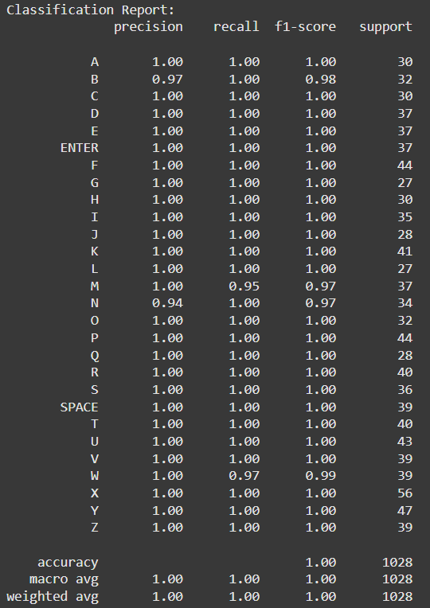
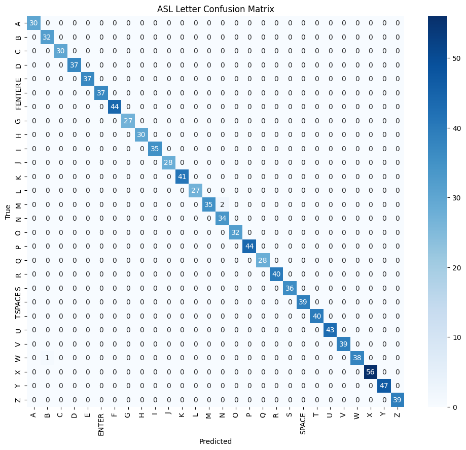

# 🖐️ Hand Gesture Control for movements and chats in Among Us using standard American Sign Language(ASL) Alphabets 🎮

> Control *Among Us* with hand gestures using real-time webcam input and a custom-trained ASL Alphabets classifier (trained on MLP, with 5138 samples captured by me).

---

## 📽️ Demo  

Watch NEURA in action:

▶️ [LinkedIn demo post](https://www.linkedin.com/posts/saumya-gupta-4385452a4_opencv-amongus-mediapipe-activity-7338291179605630976-AwcK?utm_source=share&utm_medium=member_desktop&rcm=ACoAAEloJCwBPPaMNpyq0mm_XSFMSNrM7BK6LVE)

📁 [Google Drive video folder](https://drive.google.com/drive/folders/1jppYxLMYDGygf4AumggTf-Fpdl5L1-H4?usp=drive_link)

#### ⚠️ please note

..so this project is a demo only,  not a product; and is created just for experimenting.

- designed for the web version of among us
- crewmate tasks require mouse interactions, which are not currently supported by this gesture system.
- this system is optimized for movement and action controls (e.g., walking, venting, killing, reporting, typing).


## Features  
```
- ✅ real-time ASL gesture recognition (28 gestures - 26 alphabets(standard ASL) + space(custom) + enter(custom)) 
- 🔄 gesture to text conversion in realtime in chats 
- 🎮 joystick-style finger-based movement (WASD)     
- 🔄 gesture cooldowns to prevent rapid repeat actions  
- 🔁 toggle between joystick and gesture mode  
- 🎯 custom controls for Among Us:
  - `P` → Kill + Vent  
  - `Y` → Report  
  - `ENTER` → Report meeting  
  - `F` → Toggle Joystick on/off  
```
---

## ASL Gesture Recognition Model  

### 📊 Model Architecture
- **Classifier**: `MLPClassifier` (Multi-Layer Perceptron)  
- **Hidden Layer**: 1 layer with 100 neurons  
- **Max Iterations**: 300  
- **Preprocessing**:
  - `StandardScaler` for normalization  
  - `LabelEncoder` for class encoding  

### 📁 Dataset
- **Size**: 5,138 samples  
- **Classes**: 28  
  - Letters: `A` to `Z`  (currently, letters J and Z have static samples only since dynamic are not yet supported,tho i am planning to add this in future)
  - Special: `"SPACE"` and `"ENTER"`  
- **Collected using**: Mediapipe hand landmarks  

### 🧪 Training Results
- **Test Samples Evaluated**: 1,028  
- **Accuracy**: `98%`  
- **Macro F1-Score**: `1.00`  
- **Weighted F1-Score**: `1.00`  

#### 📌 Per-Class Performance

  
*Classification report showing precision, recall, and F1 for each ASL label.*

| Class | Performance |
|-------|-------------|
| ✅ Perfect (24/28) | A, C, D, E, F, G, H, I, J, K, L, O, P, Q, R, S, T, U, V, X, Y, Z, SPACE, ENTER |
| ⚠️ slight drop | M (F1 = 0.97), N (Precision = 0.94), W (Recall = 0.97) |

  
*Confusion matrix for ASL letter classification.*

---

## 🛠️ How It Works

### 🎥 Input
- Captures webcam feed  
- Uses **MediaPipe** to detect hand landmarks  
- extracts 63 features per frame (21 landmarks × 3 coordinates)  

### 🧠 Gesture Prediction
- preprocesses input via `StandardScaler`  
- predicts gesture using pre-trained `MLPClassifier`  
- adds debounce logic and cooldown timers to prevent misclassification  

### 🕹️ Joystick Control
- Fingertip (index) position controls movement inside a dynamic virtual D-pad  
- Idle zone in center to avoid accidental key presses  
- Keys Held: `W`, `A`, `S`, `D` for movement  

### ✊ Gesture Actions
| Gesture | Action |
|---------|--------|
| `P`     | triggers both Kill (`E`) and Vent (`Space`) |
| `Y`     | triggers Report (`R`) |
| `ENTER` | triggers meeting report |
| `F`     | toggles joystick movement |
| A–Z     | typed directly as lowercase text |

---

## 📂 Folder Structure  
```
amongus_hand_control/
│
├── data/
│   ├── asl_data.csv
|
├── models/
│   ├── asl_mlp_model.pkl
│   ├── asl_label_encoder.pkl
│   └── asl_scaler.pkl
│
├── visuals/
│   ├── Classification_Report.png
│   ├── ASL_letter_Confusion_Matrix.png
|
├── movement.py             # main
├── asl_check.py
├── record_asl_data.py
├── README.md
├── requirements.txt
├── venv
├── .gitignore
```

---

## 📦 Requirements  

Install the following Python libraries:

```bash
pip install opencv-python mediapipe pyautogui numpy scikit-learn joblib
```
then run : 

```bash
python movement.py
```
---

## 🎮 Tested On  

- **Game**: Among Us
- **Platform**: PC (Windows)  
- **Python Version**: 3.8+  

---

## 🙌 Credits

- Built by: *Saumya Gupta*  
- Hand tracking: [MediaPipe](https://mediapipe.dev/)  
- Game automation: [PyAutoGUI](https://pyautogui.readthedocs.io/)  
- Game: [Among Us © Innersloth](https://www.innersloth.com/)  

---

## 📌 Future Improvements 
```
- Multi-hand support (dual gesture input)  
- Mouse control with thumb + index pinch to perform crewmate tasks
- Visual cooldown indicator on screen  
- addition of dynamic movements of ASL 'J' and 'Z' 
```
